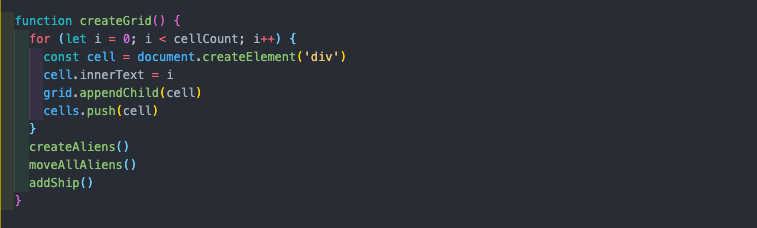

# Zeus Invades - GA Project One

## Brief

First project for the Software Engineering Immersive course. Week long solo project with the following requirements:

* Render a game in the browser
* Be built on a grid
* Design logic for winning and visually displaying winner
* Use JavaScript for DOM manipulation
* Deploy game online

## Deployment

App has been deployed with GitHub Pages can be viewed here: [Zeus Invades](https://hamzaamb.github.io/SEI-project-one/)

## Technologies Used

* JavaScript (ES6)
* HTML5
* CSS3

### Dev tools

* VS code for
* Git
* GitHub
* GitHub Pages (Deployment)

## Overview and Concept

Designed by Taito in Japan, Space Invaders hit arcades in 1978 and  is one of the most famous early video games. The game is about defending the Earth from Space Invaders (aliens) by shooting them down before they can land.

My version of the game involves the mighty Zeus and his battles in the sky. 

## Process

I started by creating a plan for all the different functionalities my game should have, once done, I split these features by MVP and Nice-To-Haves. Pseudocoding the MVP into small parts really helped in giving me a timeline, allowing more time for styling.

Creating the grid was the first task at hand, this was done by setting a value for the width and using a loop which ran till cellCount - that being the width * height, to create div elements. These divs were then pushed to an empty array and appended to the grid div in my HTML.

After the completion of the grid, I loaded my ‘ship’ which is the player, attached controls based on the arrow keys for movement and spacebar for shooting. Conditions were added to each keycode which enabled the player to stay on the grid and not fall off causing the ship icon to crash. 

Functions relating to adding and removing of the ship are passed through the block of controls, which listens out for each ‘keydown’, removes ship from previous position and adds it to the new position on grid, based on which key is pressed.

After the ship was added to the grid and able to move freely based on the user, I had to restrict the movement for the player only to the bottom grid, where they’d only be able to move left/right. 

Aliens were then spawned and this was done by assigning their starting positions on the grid.

The collision logic came next, laser movements across the grid were controlled by setInterval and the logic that involved the collision of laser and alien triggered the function to remove both images, clear the interval and add score for the player. By the end of the function, the win logic is implemented once the array that holds alien is empty. 

## Bugs

* Once the game is complete, the last alien/cloud still remains, even though the game has ended and the win logic has been implemented. 

* On some occasions, if the player shoots an alien right at the time the aliens move, two aliens get hit at the same time. 

## Wins and Challenges

### Challenges

* The alien movement proved quite difficult and took a lot of understanding to overcome it. 
* Creating the logic for collision and implementing the win/lose logic within that function was particularly challenging and found myself stuck at that the most. 

### Wins

* Achieved MVP!
* Gave me a much better understanding of how JavaScript works, found myself with clearer concepts which hadn’t been the case leading up to the project.
* Learnt how to plan well, problem solve and find solutions to small problems with the bigger picture in mind. 

## Future Content & Improvements

* Add logic for aliens to shoot back at the player
* Add more styling for the win/lose logic, which enables the players to see their full score in the middle of the grid and a button to restart the game.
* Adding responsive design
* Adding the score to local storage and creating a leaderboard.

## Key Learnings

Gained a lot of knowledge over DOM manipulation, array methods and working with timers. It was a great learning experience as it was super challenging but a great way to cement my learnings.

